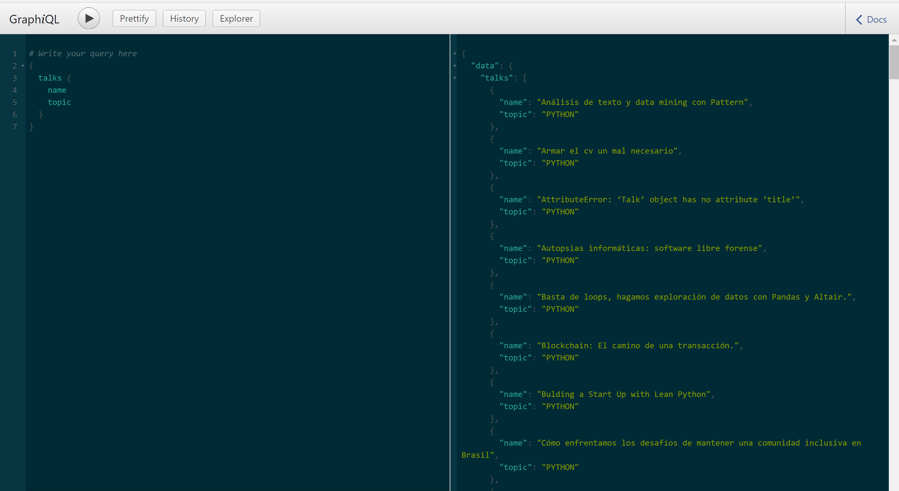

# GraphQL API Demo
This repo serves as a playground to explore the posibilities of exposing a graphql api over your data.


## Why
GraphQL is a new paradigm of API Design that is rapidly growing in popularity.
Although it's not a replacement of REST APIs, it does
help solve some of the most frequent issues of REST APIs.
By exploring this API you might get a new tool on your tech stack to consider on your next project.


## Usage
To explore the api follow these steps:
```python
python3.6 -m venv venv
source venv/bin/activate
pip install -r requirements.txt
export FLASK_APP=strawapp.flask_app
flask run
```
