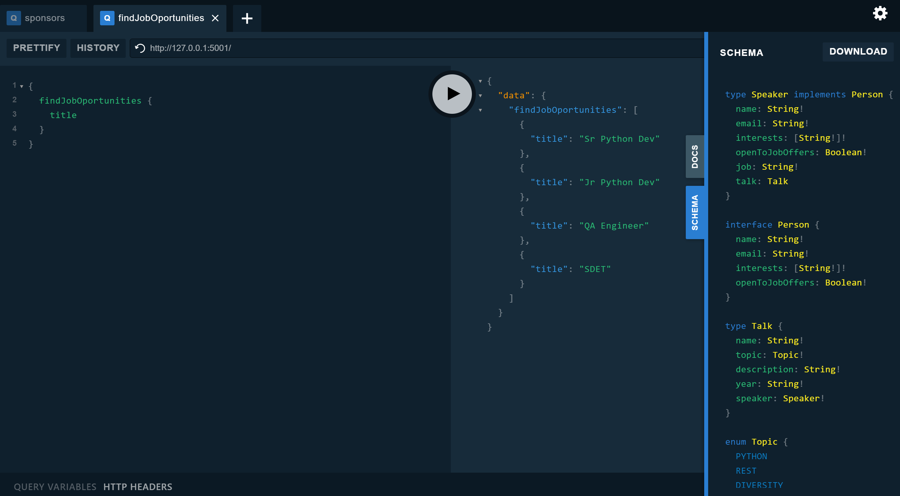

# PyconAr GraphQL Playground
`PyconAr GraphQL Playground` is a playground for anyone who wants to learn graphql interactively.


The repo has different kind of query resolvers, backed by
- DB Models
- JSON Files
- REST Calls
This is to demonstrate that there are no hard constraints on implementation details. 
We're free to do whatever fits better in our tech stack.

[Live Demo](https://pyconar.herokuapp.com/)

## Query Examples

### What are the upcoming talks?
```gql
{
  nextTalks {
    name
    description
    speaker {
      name
      bio
    }
  }
}
```

### What are the names of all people that ever gave a talk on pyconar? 
```gql
{
  allTalks {
    speaker {
      name
    }
  }
}
```

### Are there people open to receive offers?
```gql
{
  findPeopleOpenToHiring {
    name
    email
    interests
  }
}
```

### Are there companies looking to fill positions?
```gql
{
  findOpenPositions {
    title
    url
    company {
      name
      website
      technologies
    }
  }
}
```

### Are there people interested in GraphQL?
```gql
{
  findPeopleInterestedIn(interest: "GraphQL") {
    name
    email
    openToJobOffers
  }
}
```

## Run Locally
To run the server follow these steps:
```python
python3.6 -m venv venv
source venv/bin/activate
pip install -r requirements.txt
export FLASK_APP="pyconar.app:create_app()"
flask run
```
If you have docker installed you can start it with
```bash
docker build . -t pyconar-graphql
docker run -it -p 5050:5050 pyconar-graphql
```
You can also deploy to heroku with just one click

[](https://heroku.com/deploy?template=https://github.com/Ambro17/pyconar-graphql/tree/master)

## Endpoints
 - `/` GraphiQL IDE with Explorer Plugin
 - `/dark` Playground IDE with dark theme and multitab docs navigation
 - `/explorer` Api Schema Visualizer with graphqql voyager`


## Features
- IDE in Browser. _To explore the API interactively_
- Interactive Graph Explorer. _A visually compelling view of the API_
- Mutation Example. _Useful Patterns to alter data_
- Error Handling. _HTTP, what's that?_


## About GraphQL
[GraphQL](https://graphql.org/) is a new paradigm in API Design that is rapidly growing in popularity.
Although it's not a replacement of REST, it does help solve some of its most frequent problems.
I hope that exploring the API you can get a taste of the benefits of GraphQL and perhaps motivate you to write your own GraphQL PoC for your next big project.


## TODO
- DoS Protection
- Remove custom GraphiQL html as it has bugs
- Improve Mutations Auth
